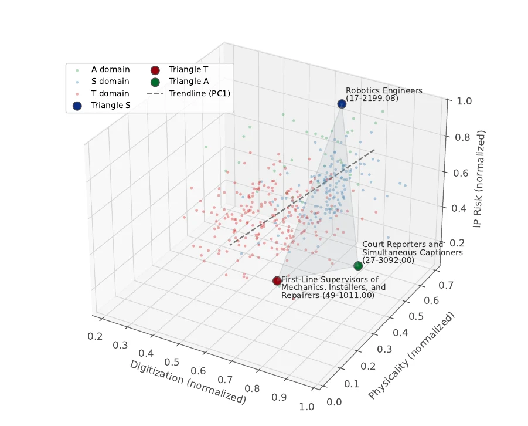

# Reshaping Occupational DNA

**A reproducible computational study of how generative AI reallocates occupational tasks and changes the design of post-secondary curricula.**

[Read the manuscript](build/main.pdf) · [Explore the data](data/README.md) · [Reproduce the analysis](#reproduce-the-analysis)



## Research question

Generative AI changes work through individual tasks rather than through occupational labels. This study asks how those task-level changes can be measured, projected through technology adoption, and translated into defensible curriculum reform.

The framework connects three levels of analysis:

1. **Occupational selection.** Six O*NET descriptors define a three-dimensional heterogeneity space. A constrained maximum-area search selects representative STEM, skilled-trade, and arts occupations.
2. **Task dynamics.** Each occupation is represented as a Task DNA: its twenty most salient O*NET tasks, weighted by importance and frequency. A nine-dimension capability scale separates substitution pressure from complementarity, and an adoption trajectory projects changing task shares.
3. **Curriculum decisions.** Course descriptions are evaluated on employability contribution, humanistic value, and AI overlap to produce conservative **KEEP**, **TRANSFORM**, and **PRUNE** recommendations.

## Study cases

| Domain | Occupation | SOC code |
|---|---|---:|
| STEM | Robotics Engineers | 17-2199.08 |
| Skilled trades | First-Line Supervisors of Mechanics, Installers, and Repairers | 49-1011.00 |
| Arts and media | Court Reporters and Simultaneous Captioners | 27-3092.00 |

The constrained search identifies this triangle with an area of **0.262221** in the normalized O*NET feature space. The same selection is recovered when the candidate pool is expanded from 200 to 800 occupations per domain.

## Main findings

- The relevant unit of change is the task portfolio: Gen-AI can compress some tasks while increasing the value of judgment, coordination, physical operations, and verification in the same occupation.
- The framework leads to distinct transition paths across the three cases, rather than a single “high-risk” label for an occupation.
- Across three exemplar programs, the recommended **TRANSFORM** sets are unchanged when the intended employment set is varied from narrow to wide definitions (Jaccard similarity = **1.00** for every program).
- Employment-contribution rankings are less stable for the skilled-trade and court-reporting programs. The framework is portable, but the target occupation set must be specified afresh when it is applied elsewhere.

These are scenario-based structural results. They describe task reallocation under explicit assumptions about Gen-AI capabilities and adoption; they are not forecasts of employment levels or a basis for automatic course removal.

## Repository map

| Path | Contents |
|---|---|
| [`main.tex`](main.tex) and [`sections/`](sections) | Manuscript source and bibliography |
| [`occupational_dna/`](occupational_dna) | Reproducible extraction, selection, simulation, and curriculum-analysis pipelines |
| [`occupational_dna/tests/`](occupational_dna/tests) | Unit and invariant tests for the core computations |
| [`data/raw/`](data/raw) | Source datasets and curriculum records; see the [data guide](data/README.md) for provenance |
| [`data/processed/`](data/processed) | Derived task DNA, scenarios, robustness summaries, and audit artifacts |
| [`figures/`](figures) | Manuscript figures and their source outputs |

## Reproduce the analysis

The project uses Python 3.14 or later and [uv](https://docs.astral.sh/uv/). The committed data snapshot contains the sources used for the current results. To refresh directly downloadable sources, use the data retrieval script described in [`data/README.md`](data/README.md).

```bash
uv sync --group dev
uv run pytest occupational_dna/tests -q
```

The full analytical sequence is explicit. Run it from the repository root when regenerating the study outputs:

```bash
uv run python occupational_dna/onet_triangle_search_all.py --mapping strict

for soc in 17-2199.08 49-1011.00 27-3092.00; do
  uv run python occupational_dna/extract_task_dna.py --soc "$soc"
  uv run python occupational_dna/relabel_task_dna_authoritative_sc.py \
    --input "data/processed/task_dna_${soc}.csv"
  uv run python occupational_dna/aggregate_authoritative_sc.py \
    --input "data/processed/task_dna_${soc}_authoritative_sc.csv"
done

uv run python occupational_dna/adoption_task_share_forecast.py
uv run python occupational_dna/curriculum_pruner.py
uv run python occupational_dna/o_variants_sensitivity.py
```

The Task DNA relabeling stage uses `sentence-transformers/all-MiniLM-L6-v2` in the reported run. Install `sentence-transformers` and retain the model version when reproducing that stage; its recorded provenance is stored beside each authoritative Task DNA summary in `data/processed/`.

To compile the manuscript:

```bash
latexmk -xelatex -interaction=nonstopmode -synctex=1 \
  -outdir=build -auxdir=build main.tex
```

## Data and reproducibility notes

The study draws on O*NET 30.1 task, work-context, work-activity, and ability tables, plus the program records under `data/raw/curricula/`. Generated outputs preserve task weights, capability assignments, summary statistics, and sensitivity artifacts so the transformation from source data to manuscript claims can be inspected.

Some raw materials are distributed under their providers’ own terms. The repository’s MIT license applies to original code and documentation; consult the upstream source and [`data/README.md`](data/README.md) before redistributing third-party data.

## Citation

If this repository informs your work, please cite the manuscript title and link to this repository. A formal archival identifier will be added when one is available.

## License

[MIT](LICENSE)
